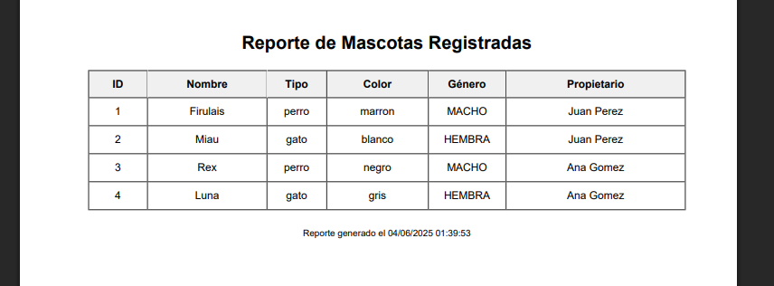
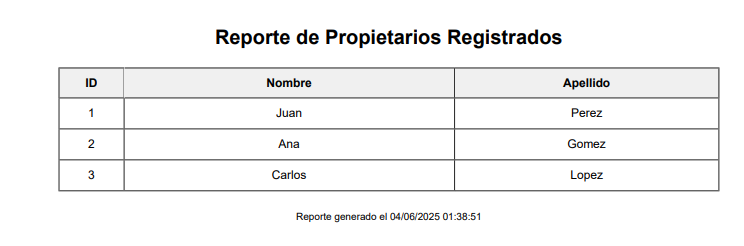

# Sistema Veterinaria - Gestión de Mascotas

Un sistema simple de gestión de mascotas y propietarios para clínicas veterinarias, desarrollado con PHP, PDO y MySQL.

## 🚀 Características

- ✅ **CRUD completo** para mascotas y propietarios
- ✅ **Generación de reportes PDF** con html2pdf
- ✅ **Base de datos relacional** con MySQL/MariaDB
- ✅ **Conexión segura** usando PDO y prepared statements
- ✅ **Arquitectura limpia** con separación de capas

## 📋 Requisitos

- **XAMPP** (Apache + PHP + MySQL)
- **PHP 7.4+**
- **Composer**

## ⚡ Instalación Rápida

1. **Clona el proyecto en XAMPP**

   ```bash
   cd C:\xampp\htdocs
   git clone [tu-repo] accesodatos
   ```

2. **Instala dependencias**

   ```bash
   cd accesodatos
   composer install
   ```

3. **Configura la base de datos**
   - Inicia XAMPP (Apache + MySQL)
   - Importa `app/database/DB.sql` en phpMyAdmin
   - O ejecuta: `mysql -u root -p < app/database/DB.sql`

## 🗂️ Estructura del Proyecto

```
accesodatos/
├── app/
│   ├── config/Database.php      # Conexión a BD
│   ├── entities/               # Entidades de datos
│   ├── models/                 # Lógica de negocio (CRUD)
│   ├── database/DB.sql         # Script de BD
│   └── test/                   # Pruebas básicas
├── views/
│   └── reports/                # Reportes PDF
└── vendor/                     # Dependencias
```

## 🧪 Pruebas Rápidas

```bash
# Probar conexión y listado
php app/test/getall.php

# Crear nueva mascota
php app/test/create.php

# Actualizar mascota
php app/test/update.php
```

## 💾 Base de Datos

El sistema maneja dos tablas principales:

**`propietarios`**

- `idpropietario` (PK)
- `apellidos`, `nombres`

**`mascotas`**

- `idmascota` (PK)
- `idpropietario` (FK)
- `tipo` (perro/gato)
- `nombre`, `color`, `genero`
- `vive` (si/no)

## 📊 Reportes PDF

El sistema incluye generación de reportes en PDF usando la librería `spipu/html2pdf`:

- Reporte de mascotas
- Reporte de propietarios
- Formatos personalizables

## 📸 Capturas de Pantalla

### Reporte de Mascotas



### Reporte de Propietarios



## 🔧 Uso Básico

### Crear una mascota

```php
require_once 'app/entities/Mascota.entidad.php';
require_once 'app/models/Mascota.php';

$mascota = new MascotaEntidad();
$mascota->__SET('nombre', 'Firulais');
$mascota->__SET('tipo', 'perro');
$mascota->__SET('idpropietario', 1);

$modelo = new Mascota();
$id = $modelo->create($mascota);
```

### Obtener todas las mascotas

```php
$modelo = new Mascota();
$mascotas = $modelo->getAll();
```

## 🛠️ Configuración

Ajusta la conexión a BD en `app/config/Database.php`:

```php
private static $host = 'localhost';
private static $dbname = 'veterinaria';
private static $username = 'root';
private static $password = '';
```

## 📚 Conceptos Implementados

- **Patrón MVC**: Separación de entidades, modelos y pruebas
- **PDO**: Uso de PHP Data Objects para acceso seguro a BD
- **Prepared Statements**: Prevención de inyección SQL
- **CRUD Operations**: Create, Read, Update, Delete
- **Joins SQL**: Consultas relacionales entre tablas
- **Manejo de Errores**: Captura de excepciones PDO
